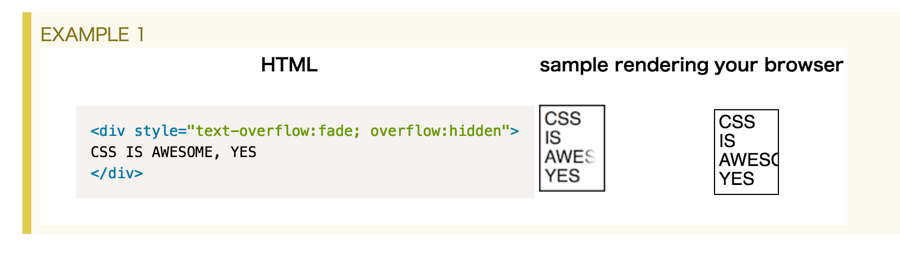
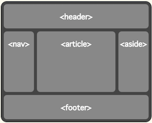
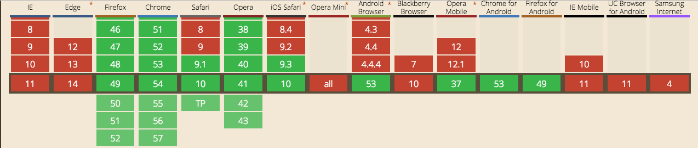

<!-- $size: 16:9 -->
<!-- $theme: gaia -->
<!-- template: invert -->
<!-- $font-family: YuGothic -->

# CSS4
##  :princess:
##### 2016/11/11

---

<!-- page_number: true -->

## :question: CSS4ってなんだ

CSS3の次のやつ（ざっくり）
⇓
CSS3からモジュールごとに仕様が策定されるようになったため、CSS4と明記できるものはない
⇓
CSS3のモジュールよりも新しく策定された要素 ≒ CSS4 という認識が広まる

#### :book: CSSの仕様策定手順

```
FPWD（初期草案）→ WD（草案）→ LCWD（最終草案）
→ CR（勧告候補）→ PR（勧告案）→ REC（勧告）
```

---

## :eyes: モジュールごとの策定状況 - 2016/11/11

TR(Technical Report)より

[Media Queries Level 4](https://www.w3.org/TR/2016/WD-mediaqueries-4-20160706/) [WD]
[Selectors Level 4](https://www.w3.org/TR/2013/WD-selectors4-20130502/) [WD]
[CSS Basic User Interface Module Level 4](https://www.w3.org/TR/2015/WD-css-ui-4-20150922/) [WD]
[CSS Pseudo-Elements Module](https://www.w3.org/TR/2016/WD-css-pseudo-4-20160607/) [WD]
[CSS Cascading and Inheritance Level 4](https://www.w3.org/TR/2016/CR-css-cascade-4-20160114/) [CR]
[CSS Color Module Level 4](https://www.w3.org/TR/2016/WD-css-color-4-20160705/) [WD]

---

## :eyes: モジュールごとの策定状況 - 2016/11/11

ほかにも

[CSS Backgrounds and Borders Module Level 4](https://drafts.csswg.org/css-backgrounds-4/#level-changes) Editor’s Draft
[CSS Fonts Module Level 4](https://drafts.csswg.org/css-fonts-4/) Editor’s Draft
[CSS Text Module Level 4](https://www.w3.org/TR/2015/WD-css-text-4-20150922/) [WD]
[**CSS Grid Layout Module Level 1**](https://www.w3.org/TR/2016/CR-css-grid-1-20160929/)
[CR] （flexboxの次のやつ）
[**CSS Custom Properties for Cascading Variables Module Level 1**](https://www.w3.org/TR/css-variables-1/) 
[CR] （CSSで変数使える）

全部の状況をみるなら → [CSS current work &amp; how to participate](https://www.w3.org/Style/CSS/current-work)

---

## :question: 現状（案件で）使えるのか

殆どが[WD]かつ[CR]のやつでも使える要素は限られている
⇓
案件で使えるレベルではない :innocent:

変更される（機能が増える or **機能が消える**）可能性も十分にある

---

## おしながき

- CSS4ってなんだ **[done]**
- Level4 Module概要
   Media Queries, Selectors, CSS Basic user Interface Module, CSS Pseudo-Elements Module, CSS Cascading and Inheritance, CSS Color Module
- Grid Layout
- CSS Variables

---

# Level 4

---

### Media Queries Level 4

Media Queryに関連する記述
Media Features / Media Types / Media Query Modifiers


### 主な変更

- `device-width` | `device-height` | `device-aspect-ratio`が非推奨に変更
- `width`は`<length>`のみに変更（`<length>`: 正の値）
- `screen` | `print` | `speech` | `all` 以外のメディアタイプが非推奨に変更

詳しくは [Changes Since the Media Queries Level 3](https://www.w3.org/TR/mediaqueries-4/#changes-2012)


---

### Selectors Level 4
セレクタ関連

[2. Selectors Overview- Selectors Level 4](https://www.w3.org/TR/selectors4/#overview)

`E:not(s1, s2)`, `E:matches(s1, s2)`, `E[foo="bar" i]`, `E:dir(ltr)`, `E:any-link`, `E:local-link`, `E:local-link(0)`, `E:scope`, `E:current`, `E:current(s)`, `E:past`, `E:future`, `E:indeterminate`, `E:default`, `E:in-range`, `E:out-of-range`, `E:required`, `E:optional`, `E:read-only`, `E:read-write`, `E:nth-match(n of selector)`, `E:nth-last-match(n of selector)`, `E:column(selector)`, `E:nth-column(n)`, `E:nth-last-column(n)`, `E /foo/ F`, `E! > F`

CSS4で追加されるものは**27種類** => 面倒なので数種類紹介

---

### Selectors Level 4

## `E:not(s1, s2)`

`E:not(s)`自体はCSS3で勧告済
CSS4: 複数値でも使用可能に

```scss
ol:not(.no-order, .no-style) {
  list-style: none;
}
```

```scss
// attribute selectorも指定可能
p:not([class], [id]) {
  margin-top: 1em;
}
```

<!--

---

## `E:mathces(s1, s2)`

途中での分岐などが書きやすくなる
**必要なのかは不明** :innocent: (こんなCSS書くこと無い)

```css
body#information #content table tbody tr th,
body#information #content table tbody tr td {
    border: 1px solid #999;
    padding: 1em;
}
```
⇓
```css
body#information #content table tbody tr :matches(th, td) {
    border: 1px solid #999;
    padding: 1em;
}
```

-->

---

### Selectors Level 4

## `E:local-link`

URLベースのスタイル適用ができる

```css
nav :local-link { text-decoration: none; }
```

- `:local-link(0)`: 同じドメイン example.com
- `:local-link(1)`: 同じドメイン + その次のパス
  example.com/first/
- `:local-link(2)`: 同じドメイン + その次のパス + その次
  example.com/first/second/

---

### Selectors Level 4

## `E! > F`

対象とするセレクタを指定できる

```scss
ul > li {
  // 「ulの子要素のli」に対するCSS
}
ul! > li {
  // 「liを子要素に持つul」に対するCSS
}
nav > ul! > li {
  // 「liを子要素、navを親要素にもつul」に対するCSS
}
```

---

### CSS Basic user Interface Module Level 4

入力や要素の振る舞いに影響するもの

`box-sizing` | `outline` | `cursor` など

---

### CSS Basic user Interface Module Level 4

### `appearance`

`appearance: auto | none`

主に`input[type]`の見た目のリセットに使ってたやつ

現在でもベンダープレフィックス付きならChromeなどで動く
[Can I use...](http://caniuse.com/#feat=css-appearance)

---

### CSS Basic user Interface Module Level 4

### `text-overflow: fade`

`text-overflow: fade | fade(<length>|<percentage>)`

overflowする部分をいい感じにfadeしてくれる（`fade` => `1em`）



---

### CSS Basic user Interface Module Level 4

### `caret`
キャレットにスタイルが充てれる！！

[参照](https://www.w3.org/TR/css-ui-4/#propdef-caret)

`caret-color` | `caret-animation` | `caret-shape`

`caret`: 上3つのショートハンド

---

### CSS Pseudo-Elements Module

疑似要素セレクタ関連

#### 追加要素

### `::marker`

`display: list-item;`の右側の黒点部分のスタイルを付けれる
（`::before`で（ry）

### `::inactive-selection`

ユーザーに`::selection`されてないところ

---

### CSS Cascading and Inheritance Level 4

カスケーディングと継承に関連するプロパティについて

`@import` | `!important`

重複 | 上書き | 優先度 周りのCSSの原則周りについて

---

### CSS Cascading and Inheritance Level 4

#### 変更点

#### `revert`（元 `default`）

一つ前のカスケードされた値を参照（基準: CSSの優先度準拠）

```scss
a { color: gray; }
a.current { color: red; }
a#important { color: revert; // = red }
```

---

### CSS Cascading and Inheritance Level 4

#### 変更点

#### `@import supports()` の挙動

以下が同義に

```scss
@import "mystyle.css" supports(display: flex);
@import "mystyle.css" supports((display: flex));
```

<!--

---

### CSS Text Module Level 4

テキスト関連のプロパティや値について

追加要素がめちゃくちゃあるので割愛 :innocent:（時間があれば）

-->

---

### CSS Color Module Level 4

#### 追加要素

#### `color-mod([ <color> | <hue> ] <color-adjuster>* )`

色の計算（ついに）

[color-adjuster](https://www.w3.org/TR/2016/WD-css-color-4-20160705/#typedef-color-adjuster)

---

### CSS Color Module Level 4

#### 追加要素

#### `color: device-cmyk();`

機種の色設定に準拠したCMYK値を設定できる

```
p { color: device-cmyk(0, 81%, 81%, 30%); }
```

[device-cmyk()](https://www.w3.org/TR/2016/WD-css-color-4-20160705/#funcdef-device-cmyk)

---

### CSS Color Module Level 4

#### 変更点

`rgb()` | `rgba()` が[0-1]指定に対応

```scss
div {
  background-color: rga(0.0, 0.78, 0.1);
}
```

`hsl()` | `hsla()` の`<hue>`の値が`<angle>`（0-360[deg]）にも対応

...など

---

# Grid Layout Module Level 1


---

flex-boxよりも汎用性の高いボックスレイアウトモジュール
[CSS Grid Layout Module Level 1](https://www.w3.org/TR/2016/CR-css-grid-1-20160929/)

現状はなんと**IE / Edgeのみ**ぎりぎり利用可能（[Can I use...](http://caniuse.com/#feat=css-grid)）



---

flex-boxよりも汎用性の高いボックスレイアウトモジュール
[CSS Grid Layout Module Level 1](https://www.w3.org/TR/2016/CR-css-grid-1-20160929/)

```pug
main
  header
  nav
  article
  aside
  footer
```

```css
main { display: grid;
       grid: "h h h"
             "a b c"
             "f f f";
       grid-template-columns: auto 1fr 20%; }
article { grid-position: b; min-width: 12em;     }
nav     { grid-position: a; /* auto min-width */ }
aside   { grid-position: c; min-width: 12em;     }
```

---

# CSS Variables

---

Pure CSSで変数が使えるように（スコープあり）

```scss
:root {
  --main-bg-color: brown;
}
div {
  background-color: var(--main-bg-color);
}
```


[CSS Variables (Custom Properties) | Can I use...](http://caniuse.com/#feat=css-variables)



---

### :pray: 参考サイト

[CSS3とCSS4の策定状況](http://uxmilk.jp/53220) - UX MILK (2016/9/16)

[CSS current work &amp; how to participate](https://www.w3.org/Style/CSS/current-work)

[CSSの変数を使う - CSS | MDN](https://developer.mozilla.org/ja/docs/Web/CSS/Using_CSS_variables)

---

# THANKS
# :princess: